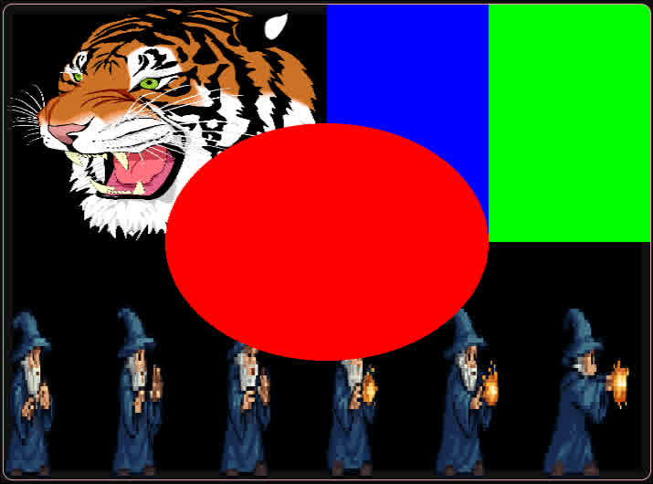

<div align="center">
<h1>egor</h1>
<p>A simple cross-patform 2D graphics engine</p>


<a href='#'></a>
<a href='#'></img></a>
<a href="https://opensourceforce.net/discord"></a>
</div>

## Features
- **Immediate-mode Style API**
  - Builder pattern for easy configuration
  - Fluent method chaining
- **Shape Rendering**
  - Solid-color/textured quads
  - Circles with adjustable segment count
- **Texture Support**
  - Load from image data
  - Automatic binding
- **Input Handling**
  - Keyboard state tracking (press/held/release)
  - Mouse position/delta & button states
  - Group key checks (all/any)
- **Shaders**
  - Automatic texture fallback
  - Customizable via WGSL

## Getting Started
Get **egor**
```bash
cargo add --git https://github.com/wick3dr0se/egor
```

Example: Creating a window, clearing the surface and drawing a circle with 100 segments
```rust
App::new()
    .run(|gfx| {
        gfx.clear(Color::GREEN);

        gfx.circle().segments(100).draw();
    });
```

See more examples in [examples/](examples/)

## Platform Support
Target | Status
---|---
Windows	| ✅ Working
MacOS | ✅ Working
Linux | ✅ Working
Web (WASM) | Planned
Mobile | Planned

## Roadmap
- Frame rate control
- Window management (resizing, fullscreen)
- Camera/viewport system
- Basic audio support
- Sprite batching
- Texture atlas support
- Custom shaders
- Blend modes
- Basic UI components

## Contributing
Could always use help.. Feel free to open an issue or PR. Contributions are much appreciated!