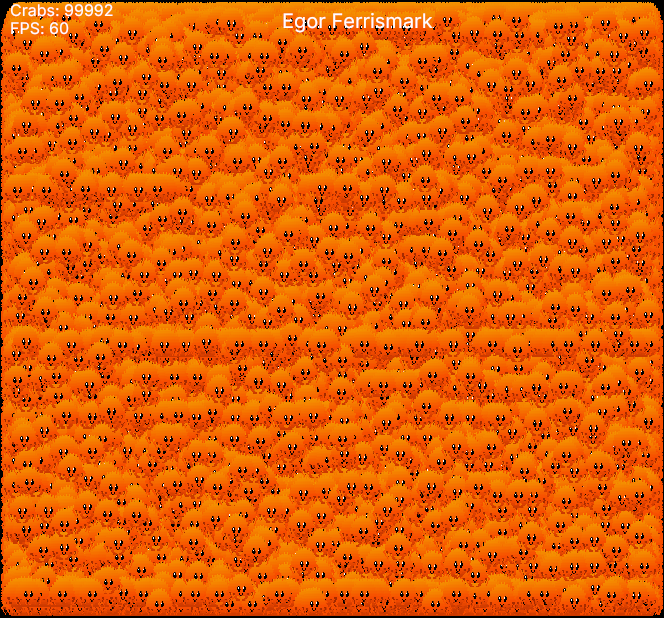

<div align="center">
<h1>egor</h1>
<p>A dead simple cross-platform 2D graphics engine</p>


<a href="https://crates.io/crates/egor"></a>
<a href='#'></img></a>  
<a href="https://opensourceforce.net/discord"></a>

</div>

## Why Egor?

**Egor** is dead **simple**, **lightweight** and **cross-platform**. The same code runs on desktop, web (WASM) and mobile with minimal boilerplate. It's built from small, composable crates on top of modern graphics and windowing abstractions

**Egor** gives you the essentials for 2D apps and games:

- Efficient 2D rendering (shapes, textures, text)
- Keyboard & mouse input
- Camera & world-space transforms
- Interactive UIs with optional **egui** integration
- Optional hot-reload during development

How many Ferris crabs can **Egor** handle? Find out in our [Ferrismark benchmark](#performance)

## Platform Support

| Target     | Backend(s)               | Status     |
| ---------- | ------------------------ | ---------- |
| Windows    | DX12, Vulkan, OpenGL     | ✅ Stable  |
| MacOS      | Metal, Vulkan (MoltenVK) | ✅ Stable  |
| Linux      | Vulkan, OpenGL           | ✅ Stable  |
| Web (WASM) | WebGPU, WebGL2           | ✅ Working |
| Android    | Vulkan, OpenGL           | ✅ Working |

## Getting Started

Add **egor** to your project:

```bash
cargo add egor
```

Example:

```rust
let mut position = Vec2::ZERO;

App::new()
    .title("Egor Stateful Rectangle")
    .run(move |FrameContext { gfx, input, timer, .. } | {
        let dx = input.key_held(KeyCode::ArrowRight) as i8
            - input.key_held(KeyCode::ArrowLeft) as i8;
        let dy =
            input.key_held(KeyCode::ArrowDown) as i8 - input.key_held(KeyCode::ArrowUp) as i8;

        position += vec2(dx as f32, dy as f32) * 100.0 * timer.delta;

        gfx.rect().at(position).color(Color::RED);
    })
```

For full documentation see the [official docs](https://docs.rs/egor/latest)

### Running a Native Build

Simply run `cargo`:

```bash
cargo run
```

### Running a WASM Build

**Setup**

Create an `index.html` next to your `Cargo.toml`:

```html
<!DOCTYPE html>
<html>
  <head>
    <meta charset="utf-8" />
    <meta name="viewport" content="width=device-width,initial-scale=1" />
    <link data-trunk rel="rust" />
    <style>
      body {
        margin: 0;
      }
      canvas {
        display: block;
        width: 100vw;
        height: 100vh;
      }
    </style>
  </head>
</html>
```

Run `trunk` (defer to [Trunk docs](https://docs.rs/crate/trunk/latest) for setup):

```bash
trunk serve
```

### Running an Android Build

**Setup**

Make sure your crate is a library:

```toml
[lib]
crate-type = ["cdylib", "rlib"]
```

Have a lib.rs with your `egor::main` function:

```rust
egor::main!(main);
pub fn main() {
    App::new().run(...)
}
```

The `egor::main!(main)` macro defines the required `android_main()` entry point on Android and forwards execution to your `main()` function. On other platforms it expands to nothing (see the secs_particles demo for reference)

Add an Android build target (if needed):

```bash
rustup target add aarch64-linux-android
```

Egor defers Android toolchain setup and build workflow to xbuild. See the [xbuild - getting started](https://github.com/rust-mobile/xbuild?tab=readme-ov-file#getting-started) for SDK/NDK and device setup

Build with `xbuild`

```bash
x build
```

### Try Out Subsecond Hot-reloading

Compile with the `hot_reload` feature enabled. Hot reload will automatically wrap `AppHandler::update` when the feature is active

Run `dioxus-cli` (defer to [Dioxus CLI docs](https://docs.rs/crate/dioxus-cli/latest) for setup):

```bash
dx serve --hot-patch
```

> [!NOTE]
> Subsecond hot-reloading is experimental; native is working

## Performance

To stress test **egor**, we made [ferrismark](demos/ferrismark), a bunnymark like demo, rendering hundreds of thousands of Ferris crabs at stable FPS on modest hardware



## Demos

To try ferrismark or see more of **egor** in action, check out [demos/](demos)

Run any demo with (see `--help` usage) xtask:

```bash
cargo xtask run <demo>
```

## Contributing

**egor** is moving fast. Before opening a PR or submitting a change, please read [CONTRIBUTING.md](CONTRIBUTING.md)

Check out some [issues](https://github.com/wick3dr0se/egor/issues), open a new one, drop a PR or come hang in [Discord](https://opensourceforce.net/discord)

---

**egor** is maintained with ❤️ by [Open Source Force](https://github.com/opensource-force)

```

```
